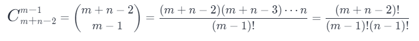

### 1.题目描述
一个机器人位于一个 m x n 网格的左上角 （起始点在下图中标记为 “Start” ）。

机器人每次只能向下或者向右移动一步。机器人试图达到网格的右下角（在下图中标记为 “Finish” ）。

问总共有多少条不同的路径？

链接：https://leetcode-cn.com/problems/unique-paths


示例 2：
输入：m = 3, n = 2
输出：3
解释：
从左上角开始，总共有 3 条路径可以到达右下角。
1. 向右 -> 向下 -> 向下
2. 向下 -> 向下 -> 向右
3. 向下 -> 向右 -> 向下

### 2.解题思路
#### 2.1 思路1
因为机器人只有可能向右或向下移动，很容易想到除首行首列外，所有格子的到达路线数=该格子上面格子+该格子右边格子路线到达数。即：
```cpp
ma[i][j] = ma[i][j-1]+ma[i-1][j]
```
时间复杂度O(m*n),过高，应该还有更快的解法。
#### 2.2 思路2
从左上角到右下角的过程中，我们需要移动 m+n-2m+n−2 次，其中有 m-1m−1 次向下移动，n-1n−1 次向右移动。因此路径的总数，就等于从 m+n-2m+n−2 次移动中选择 m-1m−1 次向下移动的方案数，即组合数：



直接计算即可。
时间复杂度O(min(m,n))，空间复杂度O(1)。
### 3.代码
#### 3.1 思路1代码
```cpp
class Solution {
public:
    int uniquePaths(int m, int n) {
        int ma[m][n];
        for(int i = 0; i < m; i++){
            for(int j = 0; j < n; j++){
                if(i==0||j==0) ma[i][j] = 1;
                else{
                    ma[i][j] = ma[i][j-1]+ma[i-1][j];
                }
            }
        }
        return ma[m-1][n-1];
    }
};
```
#### 3.2 思路2代码
```cpp
class Solution {
public:
    int uniquePaths(int m, int n) {
        long long ans = 1;
        for (int x = max(m,n), y = 1; y < min(m,n); ++x, ++y) {
            ans = ans * x / y;
        }
        return ans;
    }
};
```
